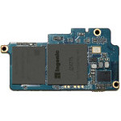

# Ingenic Newton

  
|Component|Description              |
|---------|-------------------------|
|CPU      |Ingenic JZ4775 1GHz      |
|RAM      |384MB                    |
|Storage  |4GB                      |
|WLAN     |WiFi 802.11 a/b/g/n      |
|BlueTooth|v4.2 EDR                 |
|Dimension|38mm x 22mm              |
|Others   |NFC, FM, Sensors         |

### https://steward-fu.github.io/website/index.htm
